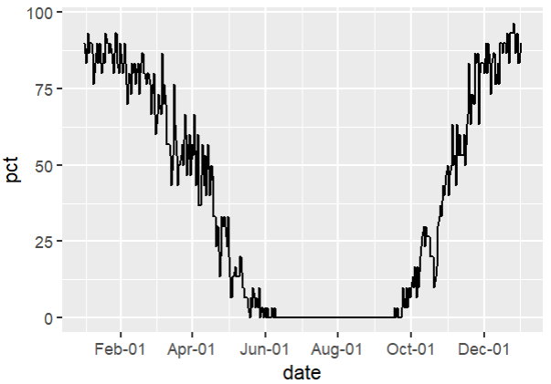

This vignette describes how to use the cFreeze package.  You start by loading the package.

```{r}
library(cFreeze)
```

## Functions

All together, the cFreeze package fuctions allow seed growers to plan mid and long term for harvest time with a better understanding of the associated historical risk of freezing events.  At this time, the cFeeze package is recommended for use in the northern hemisphere (NH) only.  

Once cFreeze is installed and loaded, you can use any of its 5 functions independently:


### nofreeze
Returns the last day to harvest (after June, NH) with no historical risk of freezing.

The usage format is: 
nofreeze(lon, lat)

```{r, eval=FALSE}
nofreeze(-118.607994, 41.659626)
[1] "Sep-17"
```


### freeze10
Returns the last day to harvest (after June, NH) with less than 10pct historical risk of freezing.

The usage format is: 
freeze10(lon, lat)

```{r, eval=FALSE}
freeze10(-118.607994, 41.659626)
[1] "Oct-2"
```

### freeze20
Returns the last day to harvest (after June, NH) with less than 20pct historical risk of freezing.

The usage format is: 
freeze20(lon, lat)

```{r, eval=FALSE}
freeze20(-118.607994, 41.659626)
[1] "Oct-9"
```


### freeze
Returns the percent historical risk of freezing for a any day of the year. 

The usage format is: 
freeze(lon, lat, Month, Mday)

```{r, eval=FALSE}
freeze(-118.607994, 41.659626, 10, 30)
[1] 43.33333
```


### plotdaysB0
Plots the percent each day of the year had temperatures below 0C.

The usage format is: 
plotdaysB0(lon, lat)

```{r, eval=FALSE}
plotdaysB0(-118.607994, 41.659626) 
```

